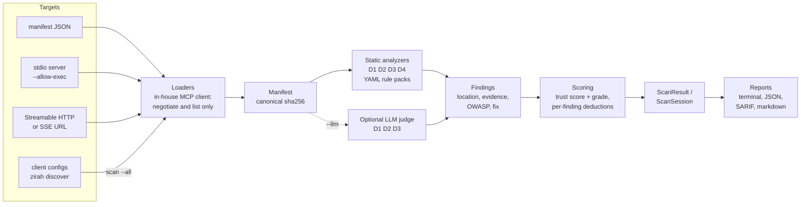

# Zirah

**Find tool poisoning, prompt injection, tool shadowing and leaked secrets in MCP servers before your agent trusts them. Offline, no account, every finding explained.**

[](https://github.com/MuhammadMohsinIbrahim/zirah/actions/workflows/ci.yml)
[](https://pypi.org/project/zirah/)
[](https://www.python.org/downloads/)
[](LICENSE)

> **Zirah** (زرہ) means *armor*.

Zirah reads an MCP server's manifest (its tools, prompts, resources and instructions), runs
detection rules over every string the model will see, and gives the server an explainable
trust score from 0 to 100. Each finding carries the exact location (a JSON pointer), the
evidence, an [OWASP MCP Top 10](https://owasp.org/www-project-mcp-top-10/) mapping and a fix.
It works fully offline; an LLM judge is optional.


## Contents

[Install](#install) · [Quickstart](#60-second-quickstart) ·
[What Zirah detects](#what-zirah-detects) · [How it compares](#how-zirah-compares) ·
[Usage](#usage) · [How it works](#how-it-works) · [Roadmap](#roadmap) ·
[Troubleshooting](#troubleshooting) · [Contributing](#contributing)

## Install

Zirah needs Python 3.12 or newer.

```bash
pipx install zirah
```

`uv tool install zirah` and `pip install zirah` work too. To run the latest code from this
repository instead:

```bash
pipx install "git+https://github.com/MuhammadMohsinIbrahim/zirah.git#subdirectory=core"
```

On Windows, if Application Control blocks the `zirah` launcher, run `python -m zirah`
instead (see [Troubleshooting](#troubleshooting)).

## 60-second quickstart

**1. Scan a server manifest.** The repository ships a harmless
[malicious demo server](examples/) to try:

```bash
git clone https://github.com/MuhammadMohsinIbrahim/zirah.git && cd zirah
zirah scan examples/malicious/manifest.json
```

It gets grade **F, trust score 0/100** with 12 findings across D1-D4, each with its
location, evidence and fix. `zirah scan examples/benign/manifest.json` gets **A, 100/100**.

**2. Check what is configured on your machine.** `discover` reads the MCP configs of Claude
Desktop, Claude Code, Cursor, VS Code and Windsurf. It is read-only and offline: nothing is
run or sent anywhere, and secrets in configs are redacted.

```bash
zirah discover
```

**3. Scan every configured server at once.** Remote servers are scanned over HTTP. Local
(stdio) servers are skipped unless you allow Zirah to start them (read the
[safety note](#running-stdio-servers---allow-exec) first):

```bash
zirah scan --all
zirah scan --all --allow-exec
```

**4. Use it in CI.** Zirah exits with 1 when a finding is at or above `--fail-on` (default
`high`), and writes SARIF for GitHub code scanning:

```bash
zirah scan server.json --format sarif -o zirah.sarif
```

## What Zirah detects

v0.1 ships static detection for five modules, mapped to the
[OWASP MCP Top 10 (2025, beta)](https://owasp.org/www-project-mcp-top-10/). Rules are YAML
files in [`core/zirah/rules/`](core/zirah/rules/), so they can be read, reviewed and extended.

| Module | Finds | Example rules | OWASP MCP Top 10 |
|---|---|---|---|
| **D1 Tool poisoning** | Text in tool names, descriptions and schemas that the model reads but the user does not see or would not accept: invisible Unicode (zero-width, bidi overrides, tag characters, variation-selector runs), ANSI escapes, homoglyph names, `<IMPORTANT>`-style hidden instructions, requests for `~/.ssh` or `.env`, concealment from the user, covert BCC/forwarding, HTML and markdown smuggling, text that tries to talk the scanner out of findings | `D1-ZERO-WIDTH`, `D1-SENSITIVE-FILE-ACCESS`, `D1-COVERT-FORWARD`, `D1-SCANNER-EVASION` | MCP03 Tool Poisoning |
| **D2 Prompt injection** | Injection in prompts, prompt arguments, resources and server instructions: overriding instructions, forged chat delimiters, jailbreak modes, system-prompt extraction, exfiltration of sensitive data, sending data to open destinations or to destinations taken from tool output or fetched pages, markdown image beacons, encoded instructions, scanner evasion | `D2-IGNORE-PREVIOUS`, `D2-EXFIL-INSTRUCTION`, `D2-EXFIL-INDIRECT-DESTINATION`, `D2-MARKDOWN-EXFIL` | MCP06 Prompt Injection via Contextual Payloads |
| **D3 Tool shadowing** | A tool that claims priority over all others, overrides or intercepts other tools, or gives orders about tools that are not in its own server | `D3-PRIORITY-CLAIM`, `D3-OVERRIDES-OTHER-TOOL` | MCP03 Tool Poisoning |
| **D4 Secrets** | API keys and tokens (AWS, GitHub, OpenAI, Anthropic, Slack), private keys, JWTs, credentials in URLs and high-entropy secret assignments in the manifest and the server's arguments. Always redacted in output | `D4-GITHUB-TOKEN`, `D4-URL-CREDENTIALS` | MCP01 Token Mismanagement & Secret Exposure |
| **D14 Shadow MCP discovery** | MCP servers configured on this machine, with servers missing from your approved list flagged | `zirah discover --approved approved.yaml` | MCP09 Shadow MCP Servers |

The optional LLM judge (`--llm`) adds semantic checks for D1-D3 that patterns miss. Its
findings are marked `engine: llm`, it never removes a static finding, and the text it reads
is fenced as untrusted data.

Detection is pattern-based and will have gaps and false positives. Please report both:
[new rule](https://github.com/MuhammadMohsinIbrahim/zirah/issues/new?template=new_rule.yml),
[false positive](https://github.com/MuhammadMohsinIbrahim/zirah/issues/new?template=false_positive.yml).

## How Zirah compares

Several good MCP scanners exist. This is how they differ, based on each project's own
documentation as of October 2026. Corrections are welcome.

| | **Zirah** | [Snyk Agent Scan](https://github.com/snyk/agent-scan) | [Cisco MCP Scanner](https://github.com/cisco-ai-defense/mcp-scanner) | [MCP Trust Checker](https://github.com/illia-haidar/mcptrustchecker) |
|---|---|---|---|---|
| License | Apache-2.0 | Apache-2.0 | Apache-2.0 | MIT |
| Runtime | Python | Python | Python | Node.js |
| Account or API key | Not needed | Snyk API token required | Not needed for YARA and heuristic scans; API keys for the LLM and Cisco AI Defense engines | Not needed |
| Where analysis runs | Locally; optional LLM judge (local Ollama, OpenAI or Anthropic) | Local checks plus the Snyk Agent Scan API (secrets redacted before sending) | Locally (YARA, heuristics); optionally an LLM provider and the Cisco AI Defense API | Locally; an optional hosted API is separate |
| Fully offline | Yes, the default | No | Yes, YARA-only | Yes, the default |
| Detection approach | YAML regex rules, optional LLM judge | Local checks plus cloud analysis | YARA rules, LLM analysis, Cisco AI Defense, behavioral code analysis | Deterministic capability-flow model, no LLM |
| Inputs | Manifest JSON, stdio, Streamable HTTP, SSE, local client configs | Local client configs (12+ agents), MCP servers, agent skills | Manifest JSON, stdio, HTTP/SSE, known client configs, source code, packages | Manifest JSON, stdio/HTTP servers, client configs, npm/PyPI packages |
| Score | 0-100 trust score and A-F grade; every deducted point listed per finding | Findings by risk type | Findings by severity | 0-100 trust score and A-F grade |
| Output | Terminal, JSON, SARIF 2.1.0, markdown | Text, JSON | Summary, table, detailed, JSON | Terminal, JSON, SARIF 2.1.0, markdown |
| Beyond manifests | Not yet: source analysis, packages and toxic flows are on the [roadmap](#roadmap) | Agent skills, toxic flows, malware | Source code behavior, packages, binaries (VirusTotal), dependencies | Cross-tool toxic flows, packages, hash pinning of tool definitions |

**Choose Zirah** if you want an offline, account-free scanner whose rules you can read and
extend, an explainable score, and SARIF for CI. **Choose another tool today** if you need
source-code, package or toxic-flow analysis, which Zirah does not do yet.

## Usage

```bash
zirah scan server.json                           # terminal report: grade, trust score, findings
zirah scan server.json --format json -o out.json
zirah scan server.json --format sarif -o zirah.sarif     # GitHub code scanning
zirah scan server.json --format markdown -o report.md    # PR comments, READMEs
zirah scan server.json --fail-on medium          # CI: also fail on medium findings (default: high)
zirah scan server.json --llm ollama:llama3.1:8b  # optional LLM judge (local); also openai, anthropic
zirah scan https://mcp.example.com/mcp           # remote server (Streamable HTTP, falls back to SSE)
zirah scan https://mcp.example.com/sse --transport sse
zirah discover                                   # MCP servers configured on this machine (offline)
zirah discover --format json --approved approved.yaml
zirah scan --all --format json -o session.json   # every discovered server, one ScanSession
zirah scan --allow-exec npx -y some-mcp-server   # run a stdio server (no isolation, see below)
```

`server.json` is an MCP manifest: the output of `tools/list`, `prompts/list` and
`resources/list` (optionally with `serverInfo` and `instructions`), a JSON-RPC response, or a
list of those. Supported MCP protocol versions: 2024-11-05, 2025-03-26, 2025-06-18,
2025-11-25 and 2026-07-28.

| Exit code | Meaning |
|---|---|
| 0 | No findings at or above `--fail-on` (default `high`; `info` fails on any finding, `none` never fails) |
| 1 | At least one finding at or above `--fail-on` (`discover`: servers missing from the approved list) |
| 2 | Usage error, target not loadable, report not writable, or an analyzer failed |

### Running stdio servers (`--allow-exec`)

A stdio server is a program, so reading its manifest means running it. **`--allow-exec`
runs the server's code on your machine with your user permissions, with no isolation.**
Zirah prints a red warning, never calls a tool, applies time and size limits, and kills the
whole process tree afterwards, but the server can still do anything your user can while it
starts. Only use it for servers you would run anyway, and prefer a static manifest when you
can. Container isolation (`--docker`) is planned for v0.2.

### Approved servers

`discover` flags servers that are not on your approved list
(`~/.config/zirah/approved.yaml`, `--approved`, or `ZIRAH_APPROVED`). Every key given in an
entry must match:

```yaml
servers:
  - name: github
  - command: npx -y @modelcontextprotocol/server-filesystem
  - url: https://mcp.example.com/mcp
  - client: claude-desktop
```

### LLM judge

| `--llm` / `ZIRAH_LLM` | Needs |
|---|---|
| `none` (default) | nothing; fully offline |
| `ollama[:model]` | a local Ollama (`OLLAMA_HOST`, default `http://localhost:11434`) |
| `openai[:model]` | `OPENAI_API_KEY` |
| `anthropic[:model]` | `ANTHROPIC_API_KEY` |

API keys are read only from the environment and sent only to the selected provider.

## How it works



- **Loaders** turn a target into a `Manifest`. The MCP client is a small in-house
  implementation that only negotiates the protocol and lists tools, prompts and resources;
  it never calls a tool, and it limits message size, item counts, pages and time.
- **Analyzers** share one interface and run concurrently. One crashing analyzer is reported
  and the scan goes on (exit code 2, so an incomplete scan is never called clean).
- **Scoring** groups findings by location, applies diminishing returns and hard caps
  (critical + high confidence caps the score at 39), and lists every deducted point.
- **Reports** escape invisible characters and terminal sequences, and redact secrets.

The full design is in [SPEC.md](SPEC.md).

## Roadmap

| Release | Focus |
|---|---|
| **v0.1** (this release) | CLI core: loaders, D1-D4, D14 discover, `scan --all`, scoring, reports, optional LLM judge |
| v0.2 | Deep static: npm/PyPI/git source, dangerous code sinks (Semgrep), capability profile, dependency CVEs and package risk, `--docker` runner, GitHub Action, `zirah mcp` server mode |
| v0.3 | Public registry with signed attestations, version history and rug-pull (manifest drift) detection |
| v0.4 | Sandbox detonation: canary secrets, egress capture, schema fuzzing, response poisoning |
| v0.5 | Cross-server attack graph (lethal trifecta), published precision/recall metrics |
| v0.6 | Agent Skills and A2A Agent Cards |

Details: [SPEC.md, section 6](SPEC.md#6-roadmap) and the task list in
[docs/PLAN.md](docs/PLAN.md). Changes per release: [CHANGELOG.md](CHANGELOG.md).

## Troubleshooting

**`zirah` is blocked on Windows** ("An Application Control policy has blocked this file",
os error 4551). Windows Application Control or Smart App Control can block the small
`zirah.exe` launcher that pip, pipx or uv create. Run the same CLI through Python:

```bash
python -m zirah scan server.json
uv run python -m zirah scan server.json   # from a clone of this repository
```

**`refusing to run ...: Pass --allow-exec`.** The target was read as a stdio command (it is
not an existing file or an http(s) URL). Check the path, or add `--allow-exec` if you do
mean to run the server. In `scan --all`, stdio servers are skipped with a note unless you
pass `--allow-exec`.

**`unsupported MCP protocol version`.** The server speaks a version Zirah does not know.
The error lists both sides' versions; please open an issue with them.

**`not a Streamable HTTP MCP endpoint (HTTP 404/405)`** or **`no SSE endpoint event`.**
Check the URL path (often `/mcp` for Streamable HTTP and `/sse` for SSE) or force the
transport with `--transport streamable-http` or `--transport sse`. Zirah sends no
credentials, so servers that require auth cannot be scanned remotely yet; scan a static
manifest instead.

**`gave up after 120 s in total` or `no response to ... within 30 s`.** The server is slow
to start or to answer. Servers launched with `npx -y` may be downloading packages; run the
command once by hand first.

**Strange characters in the report.** Zirah prints invisible and control characters as
escapes (`\u200b`, `\x1b`) on purpose, so you see what the model would receive.

**A finding looks wrong.** Report a
[false positive](https://github.com/MuhammadMohsinIbrahim/zirah/issues/new?template=false_positive.yml)
with the rule id and the text.

## Contributing

Rules with good fixtures, false-positive reports and bug fixes are welcome. See
[CONTRIBUTING.md](CONTRIBUTING.md) (including how to add a detection rule), the
[Code of Conduct](CODE_OF_CONDUCT.md) and the [CHANGELOG](CHANGELOG.md).
Report security problems in Zirah privately, as described in [SECURITY.md](SECURITY.md).

Development setup:

```bash
uv sync                                  # install
uv run pytest                            # tests (coverage floor 95%)
uv run ruff check . && uv run mypy core  # lint + types
```

## Author

Zirah is written and maintained by
**[Muhammad Mohsin Ibrahim](https://github.com/MuhammadMohsinIbrahim)**.

## License

[Apache-2.0](LICENSE)
